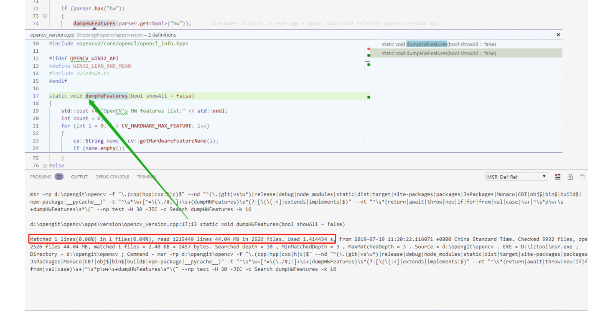
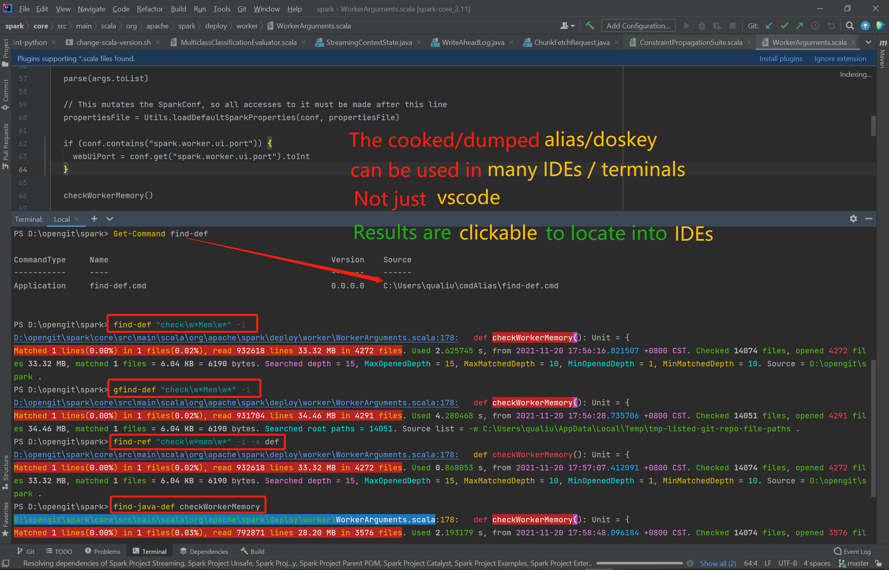
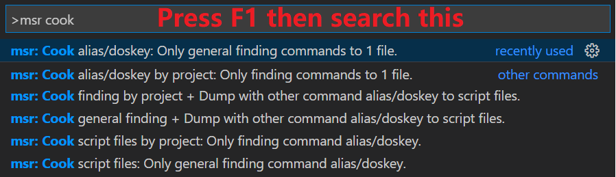
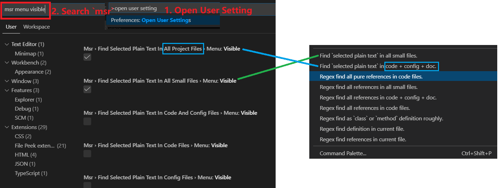
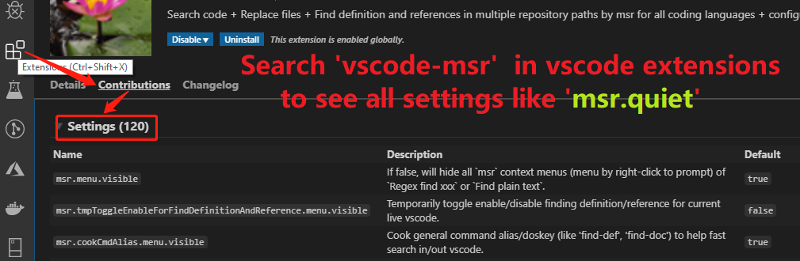
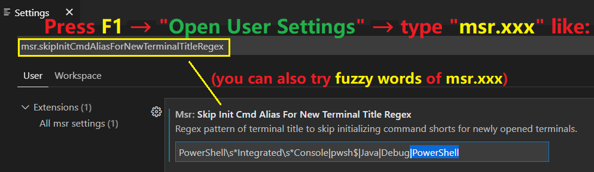

# [vscode-msr](https://github.com/qualiu/vscode-msr/blob/master/README.md#vscode-msr) for [IDEs on Windows/Linux/MacOS](#the-cookeddumped-aliasdoskey-can-be-used-in-many-ides-not-just-vscode)

Have you suffered issues below in your daily work?

- **Find Definition**: Unable to `jump-to-definition`?
  - Lack of dependency packages / build , or failed to build?
  - IDE/extension often caught some problems?
  - Cannot cross `multiple languages`? `C#` , `C++` , `Java`/`Scala`, `Python`, `Proto`, etc.
  - Cannot cross `multiple repositories`?
- **Search Code**
  - Clumsy and slow in IDE? Too **narrow** `vscode` panel to preview?
  - Wasting time to click and expand **each** item?
  - Lack of a powerful tool to [**learn/ramp-up code by yourself**](#code-mining-without-or-with-little-knowledge) ? (filter + stats + compare/analogy).
  - `What if` a **colorful** + **fast** glance for **all search results** + [**rich and powerful filters**](#search-files-with-rich-filters)?
- **Replace File Text**
  - **Missed changes to some files**(like `doc`/`config`) or **other languages** not loaded in IDE?
  - Your replacing tool **added** or **removed** the `tail empty line` ? And cause wrong `git diff` ?
  - Your replacing tool changed your file time even nothing changed?
  - `What if` a fast way to replace? [**Just reuse**](#reuse-the-command-to-search-further-or-replace-file-text) the **`powerful search used above`**?
- Just **read code** but **inefficient** ? or **insufficient** resource on laptop?
  - Too slow + hard to prepare environment for IDE to load code? Especially from other teams?
  - Must install **X GB language plugins**?
  - Must download **Y GB packages** to the disk?
  - Must build **Z GB outputs** to the disk (like C#) before you can read code?
  - Offer **N GB running memory** to the `official/professional` language extensions?

Then it's the **light** + **right** tool for you(**2~3 MB** storage + **1~5 MB** running memory) to search + replace file text.

**Note**: ([**Temp-toggle**](#get-the-best-combined-power) or [**change settings**](#disable-finding-definition-and-references-for-specific-file-types) for languages disabled by default settings.)

### **You Can Start Using this without Doing Anything**

You can start [**search**](#search-files-with-rich-filters) + [**replace**](#replace-file-text-with-preview-and-backup) + [**code mining**](#code-mining-without-or-with-little-knowledge) via [**mouse**/**menus**](#hide-or-show-more-context-menus) + [**keys**](#get-the-best-combined-power) + [**terminals**](#make-command-shortcuts-to-search-or-replace-in-or-out-of-vscode) **without** reading/doing anything **except**:

- [Cook doskey/alias](#make-command-shortcuts-to-search-or-replace-in-or-out-of-vscode) if you want to search/replace **out of vscode** (in `CMD`/`Bash` + other IDEs).
  - See [**Best Practice** to search/update repo](#best-practice-to-update-git-repo-and-search-code) + [Get **Combined Power**](#get-the-best-combined-power).
- [**Set exclusions**](#avoid-security-software-downgrade-search-performance-on-windows) on Windows if you cannot get search results **in 1~2 seconds** for just **10000 code files**.
- [**Adjust output colors**](#adjust-your-color-theme-if-result-file-path-folder-color-is-not-clear) of both **file paths** and **matched text** with 2 methods.

### Supported Platforms

- **Windows**
  - `x86_64`: Version >= `Windows 7`: 64-bit + 32-bit Windows including **MinGW**.
  - `Arm64`: Version >= `Windows 8.1`.
  - **Cygwin**: Version >= `Cygwin 5.4.0`.
  - **WSL**: Same with `Linux` below.
- **Linux**
  - `x86_64`: Kernel >= `2.6.32` 64-bit + 32-bit **Ubuntu** + **CentOS** + **Fedora**.
  - `Arm64`: Kernel >= `4.15` (like `Ubuntu 18.04`).
- **MacOS**
  - `Arm64`: Version >= `Darwin 21.1.0`.
- **FreeBSD**
  - `amd64`: Version >= `FreeBSD 11.0` (older versions not tested).

## Features

- Got search results in **1~3 seconds** for 20000+ code files (on hard-drives, **SSD** maybe faster) after first time (cost 10~30+ seconds).

- Fast find **definitions** + **references** for **all types** of coding languages across [**multiple related repositories**](#extra-paths-settings).

- **Self-reliance**: Learn/Ramp-up faster **by yourself** -- [**Code Mining without or with Little Knowledge**](#code-mining-without-or-with-little-knowledge).

- [**Normal** + **Extensive Search**](#normal-and-extensive-search): Search by hot-keys/menus or typing text, in or out of VSCODE.

- **Easy** + **Fast** to [**Search Further** or **Replace File Text**](#reuse-the-command-to-search-further-or-replace-file-text): Just **reuse** the search command line by an upper arrow.

- [**Powerful** + **Convenient command alias**](#make-command-shortcuts-to-search-or-replace-in-or-out-of-vscode) to **search**/**replace** code/config/doc files **in**/**out-of** `vscode`.

- **Easy** + **Fast** to [**Get the Best Combined Power**](#get-the-best-combined-power) of `vscode-msr` + official language plugins.

- [Every function is **under your control**](#every-function-is-under-your-control-and-easy-to-change) and easy to enable or disable.

- [**Easy to Support New Languages**](#easy-to-support-new-languages) with 2 methods.

- **Automated** command shortcuts on **Linux** + **WSL** + [**4 types of terminals on Windows**](#supported-4-terminal-types-on-windows).

- [Simple + flexible config](#other-optional-settings-and-full-priority-order-of-config-override-rule): **General Regex** of `C++`,`Java`,`C#`,`Python`.

- All just leverage [tiny msr+nin EXE](https://github.com/qualiu/msr/blob/master/README.md) **without** `storage`/`cache`, `server`/`service`, `network`, etc.

[Screenshot-1](images/find-def-ref.gif): Search **Definitions** + **References** for **C++** / **Python** / **Java** in `vscode`:



### The [cooked/dumped alias/doskey](#make-command-shortcuts-to-search-or-replace-in-or-out-of-vscode) can be used in **many IDEs**, not just **VSCode**.

[Cook + **Dump** script files](#make-command-shortcuts-to-search-or-replace-in-or-out-of-vscode) for **other IDEs** or **system terminals** out of vscode.

Since out of `vscode`, no menus/mouse support, use `gfind-xxx`/`find-xxx` to [search](#code-mining-without-or-with-little-knowledge) and [replace](#replace-file-text-with-preview-and-backup), see [screenshot-2](images/cooked-cmd-alias-doskeys-can-be-used-in-many-IDEs.png):


More powerful usages + examples see [overview doc](https://github.com/qualiu/msr/blob/master/README.md) or just run [msr/nin](https://qualiu.github.io/msr/usage-by-running/msr-Windows.html) to see [color doc](https://qualiu.github.io/msr/usage-by-running/msr-Windows.html) (Windows, [Linux here](https://qualiu.github.io/msr/usage-by-running/msr-CentOS-7.html)) or [text doc](https://raw.githubusercontent.com/qualiu/msr/master/tools/readme.txt).

## More Freely to Use and Help You More

Auto added [msr](https://github.com/qualiu/msr#liberate--digitize-daily-works-by-2-exe-file-processing-data-mining-map-reduce) folder to `%PATH%` (Windows) or `$PATH`(Linux) to help your [daily file processing](https://github.com/qualiu/msr/blob/master/README.md#scenario-glance).

### Default: Auto Check and Download Tools and Add to PATH

If not found [msr](https://github.com/qualiu/msr#liberate--digitize-daily-works-by-2-exe-file-processing-data-mining-map-reduce) in `%PATH%` or `$PATH`:

- **Windows**: If not found in `%PATH%` by command `"where msr.exe"`
  - Auto check and download to `%USERPROFILE%\msr.exe` when launching vscode.
  - Add `%USERPROFILE%` to `%PATH%` **temporarily** each time in each [newly opened terminal](#auto-set-command-shortcuts-for-new-terminals).
- **Linux**/**MacOS**/**FreeBSD**: If not found in `$PATH` by command `"which msr"`
  - Auto check and download to `~/msr` when launching vscode.
  - Add `~/` to `$PATH` **temporarily** each time in each [newly opened terminal](#auto-set-command-shortcuts-for-new-terminals).

This helps using `msr` [command lines](#reuse-the-command-to-search-further-or-replace-file-text) or [`find-xxx`/`gfind-xxx`](#command-shortcuts) **outside** `vscode`.

### Or Manually Download and Set PATH Value Once And Forever

See [manually downloading](Manually-Download-Tools.md) tool command lines on `Windows`/`Linux`/`MacOS`/`FreeBSD`.

- You can also get downloading command line from `MSR-Def-Ref` channel in `OUTPUT` tab.
- Delete existing `msr`/`nin` if now show command or if you want to update immediately.
  - Check location like `where msr` (Windows) or `which msr` (Linux/MacOS/FreeBSD).

## Adjust Your Color Theme if Result File Path Folder Color is Not Clear

If the `color` of output result file paths is not clear to read when using default `dark-blue` color theme.

### Adjust Colors Method-1

To adjust the colors, for example, if it's default `dark-blue` color theme:

- Open your [personal settings file](https://code.visualstudio.com/docs/getstarted/settings#_settings-file-locations) with `code` or other tools like:
  - Windows: code `%APPDATA%\Code\User\settings.json`
  - Linux: code `$HOME/.config/Code/User/settings.json`
- Add or change **terminal.ansiBrightBlue** like below: (Add outer brackets `"{ }"` if the file is empty)

```json
"workbench.colorCustomizations": {
  "terminal.ansiBrightBlue": "#5833ff"
}
```

More details or other color settings follow [official vscode doc](https://code.visualstudio.com/docs/getstarted/themes#_customizing-a-color-theme).

### Adjust Colors Method-2

You can set environment variable **MSR_COLORS** to [change color-groups](https://github.com/qualiu/msr#set-or-change-color-groups) of both **file paths** and **matched text**:

- Temporarily set env in a terminal/console:

  - Windows example for color group of `result file paths`:
    - `set MSR_COLORS=p=Green` or `set MSR_COLORS=d=Cyan,f=Green`
  - Linux/MacOS/FreeBSD example:
    - `export MSR_COLORS=p=Green` or `export MSR_COLORS=p=Cyan,f=Green`

- Temporarily set env in [user settings](#extension-settings-if-you-want-to-change):
  - Windows:
    - Add/update `msr.cmd.postInitTerminalCommandLine` with above `"set MSR_COLORS=xxx"` command.
  - Linux/MacOS/FreeBSD:
    - Add/update `msr.bash.postInitTerminalCommandLine` with above `"export MSR_COLORS=xxx"` command.

## Avoid Security Software Downgrade Search Performance on Windows

If you cannot get search results **in 1~2 seconds** for just **10000 code files**:

- Follow [official Windows doc](https://support.microsoft.com/en-us/help/4028485/windows-10-add-an-exclusion-to-windows-security) to add exclusion.
- Same with using alias `trust-exe` (run as `Administrator` in a `new` CMD window):
  - Run "**trust-exe** `msr,nin`" (input exe `name` or `title` or `path`).
    - This will auto fetch exe paths and use `PowerShell "Add-MpPreference -ExclusionPath $exePath"`.
    - You can also use `trust-exe` with `git`/`ssh`/`bash`/`node.exe`/`pip.exe`/`python.exe`/`golang` etc.

## Prefer Precision over Speed when Searching Definitions

You can change the value for **small projects** which you can prefer **precision** over **speed** since it's fast:

- Global change: `msr.default.preferSearchingSpeedOverPrecision` = `false`.
- For a project: `msr.{project-folder-Name}.preferSearchingSpeedOverPrecision` = `false`.
- For C# code: `msr.cs.preferSearchingSpeedOverPrecision` = `false`.

More override settings see: [**full priority rule**](Add-New-Language-Support-For-Developers.md#full-priority-order-of-config-override-rule).

## Make Command Shortcuts to Search or Replace In or Out of VSCODE

Transform each alias/doskey to a script file to help searching or replacing in or out of vscode.

- Open any file in vscode, right click, choose menu: **"Cook general + Dump other alias to scripts"**.
- Or use [Command Palette](https://code.visualstudio.com/docs/getstarted/tips-and-tricks#_command-palette) like below to find `"msr: Cook xxx"` menus and dump scripts:



Dump 1 or multiple script files into `msr.cmdAlias.saveFolder` - default location:

- Single alias/doskey file: Save to `%USERPROFILE%\` on Windows or `~/` on Linux/MacOS/FreeBSD.

- Multiple script files: Save to `%USERPROFILE%\cmdAlias\` on Windows or `~/cmdAlias/` on Linux/MacOS/FreeBSD.

Auto [**set project specific alias**](#auto-set-command-shortcuts-for-new-terminals) for new terminals in vscode, according to repo [`.gitignore`](#use-git-ignore) plus `.vscode/settings.json`.

### Best Practice to Update Git Repo and Search Code

- Please use `gpc` or `gpc-sm`/`gpc-sm-reset` / `git-sm-xxx` to pull/update your git repository.
- Set `msr.refreshTmpGitFileListDuration` to large value(like `12hours` / `3days`) if you always update code as above.
  - Run `gpc` or [**del-this-tmp-list**](#try-rgfind-xxx-to-search-multiple-git-repositories) whenever you need to update git-paths (used by [**gfind-xxx**](#try-to-use-gfind-xxx-instead-of-find-xxx-aliasdoskey)) from menu or command you type.
- 3 methods to solve `gfind-xxx` drawbacks of possible using outdated tmp-git-paths-list:
  - 1(Radical): Set `msr.refreshTmpGitFileListDuration` with **small value** like `0second` / `2m`.
  - 2(Normal): Run `del-this-tmp-list` before `gfind-xxx` if you added new files, or switched branches, or used `gfind-xxx` in descendant folders.
  - 3(Inaccurate): Use [**find-xxx**](#try-rgfind-xxx-to-search-multiple-git-repositories) which has same results of `gfind-xxx` most time.
    - For menus: Change [msr.useGitFileListToSearchSingleWorkspace](#try-to-use-gfind-xxx-instead-of-find-xxx-aliasdoskey) from `auto` to `false`.

### Try to use gfind-xxx instead of find-xxx alias/doskey

Use **gfind-xxx** alias/doskey/scripts which uses **accurate** source file paths by "`git ls-files`".

- This's helpful if got [**git-exemption-warnings**](#use-git-ignore) for a git repo.
- You can change `msr.refreshTmpGitFileListDuration` to avoid writing tmp-paths-list too frequently.
  - See above [best practice](#best-practice-to-update-git-repo-and-search-code) of integrating update-repo + search/replace code.
- Try [**rgfind-xxx**](#try-rgfind-xxx-to-search-multiple-git-repositories) to search multiple git repositories.
- Use `msr.useGitFileListToSearchSingleWorkspace` for menu search using git file list.
  - Default = `auto` which use git-file-list only when it's a git repo + found git exemptions.
    - If no git exemptions, `find-xxx` are same with `gfind-xxx`.
  - Set to `true` if you always want to use `gfind-xxx` to search.
  - Set to `false` if you frequently hit drawbacks of `gfind-xxx` + bored of using [del-this-tmp-list](#best-practice-to-update-git-repo-and-search-code).
- To skip huge dependent git submodules(sub-repos) for a large project/repository:
  - Set `msr.searchGitSubModuleFolders` = `false` or set it per repo like:
    - `msr.{repo-folder-name}.searchGitSubModuleFolders` = `false`.

### Cooked Alias Script File Output Types

#### One Single Alias File

Press `F1` if not shown in right-pop menu, then search `msr Cook xxx` as below:

- **General command shortcuts**
  - Click/Choose **`"Cook general alias to 1 file"`** to cook **general command shortcuts**.
  - Please **re-cook** this if [**added new languages support**](#easy-to-support-new-languages) including [**fastest adding**](#fastest-and-easiest-way-to-support-new-language).
    - Will not **auto update** if once cooked + nothing changed (like `msr.xxx.definition` settings).
- **Project specific shortcuts**
  - Choose `"Cook project specific alias to 1 file"` for current git repo.
  - Not recommended unless you only work with 1 project.
- Notes for both **general + specific** shortcuts in **single** file:
  - **Auto initialized and effect in vscode** when opening new terminals:
    - Skip paths Regex: `--np "skip-by-git-ignore"` (if enabled [git-ignore](#use-git-ignore)).
    - Skip folders Regex: `--nd "default-and-project-exclude"`
  - System console (`CMD/bash`) will auto load these `doskey/alias` when opening new terminals.

#### Multiple Script Files

Choose menus below: More freely to use (**in other script files** or **nested command lines** like pipe)

- `"Cook scripts: General alias"`
- `"Cook scripts: Project specific alias"`
- **`"Cook general + Dump other alias to scripts"`**

This **enables you to use alias/doskeys (like `find-def`) everywhere** like:

- Nested commands/pipe like `for-loop` in CMD/Bash + `while-loop`, etc.
- Script files (like `*.cmd` + `*.bat` + `*.sh` + `*.ps1` etc.)
- Interactive `PowerShell` terminal/console (`PowerShell` cannot use `doskey/alias`).

#### Additional Tips

- Tip for [**msr advantage**](https://github.com/qualiu/msr#tip-for-captured-groups-reference-to-replace-files-or-transform-text) on **Windows**(including `MinGW` + `Cygwin`) + **Linux**/**MacOS**/**FreeBSD**:
  - You can use `"\1"` instead of `"$1"` to avoid conflict if your `doskey`/`alias` contains **`Regex-Replacing`** commands:
    - `Regex replace-to` conflict with `doskey macro` variables like **$1** on Windows.
    - `Regex replace-to` conflict with `bash` variables like **$1** on Linux/MacOS/FreeBSD.
  - Same that using **\2** **\3** is better than **$2** **$3** and etc.
- For full or relative result file paths:
  - Type `out-fp` to output full file paths of search results.
  - Type `out-rp` to output relative paths.

Many other [**common shortcuts**](/src/commonAlias.ts) like (run `alias` to see all alias/doskeys):

- Windows + Linux/MacOS/FreeBSD:
  - git shortcuts:
    - Type `gpc` to pull current branch + `gph` to push current branch + `gfc` to fetch current branch.
    - Type `gpc-sm`/`git-sm-reset` to update/reset submodules + `git-sm-reinit` to fix tough issues.
    - Type `git-cherry-pick-branch-new-old-commits` to cherry pick commits of a branch from old to new commits.
- Windows CMD only:
  - Now auto output forward slash **temporarily** in `VsCode` terminals by config `msr.xxx.postInitTerminalCommandLine`.
    - You can add/remove more MSR_XXX variables like `MSR_EXIT` / `MSR_UNIX_SLASH` / `MSR_KEEP_COLOR` / etc.
  - Type `win11-ungroup-taskbar` to ungroup Windows11 taskbar + `win11-group-taskbar` to restore/group taskbar on Windows 11.
  - Type `reload-env` to reload environment variables + `reset-env` to **clear** and **reload** them.
  - Type `add-user-path` / `add-sys-path` / `add-tmp-path` + `del-user-path` / `del-sys-path` / `del-tmp-path` to add/delete %PATH% values.

### Command Shortcuts

- You can **add**/**update** alias/doskeys in cooked file (see tip in vscode).
- Automated command shortcuts on **MacOS**/**FreeBSD**/**Linux** + **WSL** + [**4 types of terminals** on Windows](#supported-4-terminal-types-on-windows) to [search](#search-files-with-rich-filters) or [**mining-code**](#code-mining-without-or-with-little-knowledge) or [replace file text](#replace-file-text-with-preview-and-backup).
- Use [**gfind-xxx**](#try-to-use-gfind-xxx-instead-of-find-xxx-aliasdoskey) instead of **find-xxx** if warned [**exemptions**](#try-to-use-gfind-xxx-instead-of-find-xxx-aliasdoskey) when initializing new terminals.
- You can search **in vscode terminal** then **click** the results to **open and locate** them.
- You can also start [**code-mining**](#code-mining-without-or-with-little-knowledge) or [replacing files](#replace-file-text-with-preview-and-backup) out of vscode ([System terminals or other IDEs](#the-cookeddumped-aliasdoskey-can-be-used-in-many-ides-not-just-vscode)).
  - Run **use-this-alias** to load alias/env for current git repo.
- If using alias(like `find-spring-ref`) in a **nested command** (like `for/while-loop` or `command|pipe`), or **script files** (like `*.bat/cmd` or `*.sh`)
  - Use **full-name** (like `find-spring-ref.cmd`) or **full path** (like `~/cmdAlias/find-spring-ref`).

#### If You Want to Remove Command Shortcuts from System when Uninstalling vscode-msr

- Windows command to remove registration of [doskey file](#make-command-shortcuts-to-search-or-replace-in-or-out-of-vscode) (default: `%USERPROFILE%\msr-cmd-alias.doskeys`):
  - `REG DELETE "HKEY_CURRENT_USER\Software\Microsoft\Command Processor" /v Autorun /f`
- Linux/MacOS/FreeBSD + MinGW/Cygwin command (default file: `~/msr-cmd-alias.bashrc`):
  - `msr -p ~/.bashrc -t "^source ~/msr-cmd-alias.bashrc" -o "" -R`

### Try rgfind-xxx to Search Multiple Git Repositories

After [cooking alias scripts](#make-command-shortcuts-to-search-or-replace-in-or-out-of-vscode), you can use **rgfind-xxx** like `rgfind-cpp-ref MySearchWord` to **recursively** search multiple git repositories in a folder.

- Difference between **rgfind-xxx** and [**gfind-xxx**](#try-to-use-gfind-xxx-instead-of-find-xxx-aliasdoskey):
  - `gfind-xxx` can only be used in a single git repository, not parent folder of multiple git repositories.
- Difference between **gfind-xxx** and [**find-xxx**](#code-mining-without-or-with-little-knowledge) (same search results most time):
  - `find-xxx` may waste time on non-repo files thus **may not** provide accurate results as `gfind-xxx`.
    - But `find-xxx` are **better** than `gfind-xxx` in scenarios below:
      - New files not in git - `gfind-xxx` cannot find them, use `find-xxx`.
      - Switched branches or search-folders or sub-modules(without `git-sm-xxx`):
        - Run [**del-this-tmp-list**](#best-practice-to-update-git-repo-and-search-code) before `gfind-xxx`, or use `find-xxx`.
  - `gfind-xxx` / `rgfind-xxx` auto run `git ls-files` first to get precise file list save to a tmp file.

```bash
Now you can directly use the command shortcuts in/out-of vscode to search + replace like:
find-ndp path1,path2,pathN -t MySearchRegex -x AndPlainText
find-nd -t MySearchRegex -x AndPlainText
find-code -it MySearchRegex -x AndPlainText
find-small -it MySearchRegex -U 5 -D 5 : Show up/down lines.
find-doc -it MySearchRegex -x AndPlainText -l -PAC : Show pure path list.
find-py-def ClassOrMethod -x AndPlainText : Search definition in python files.
find-py-ref MySearchRegex -x AndPlainText : Search references in python files.
find-cpp-ref "class\s+MyClass" -x AndPlainText --np "unit|test" --xp src/ext,src/common -c show command line.
find-java-def MyClass -x AndPlainText --np "unit|test" --xp src/ext,src/common -c show command line.
find-java-ref MyClass --pp "unit|test" -U 3 -D 3 -H 20 -T 10 :  Preview Up/Down lines + Set Head/Tail lines in test.
find-ref OldClassOrMethod -o NewName -j : Just preview changes only.
find-ref OldClassOrMethod -o NewName -R : Replace File Text.
find-spring-ref - find variations of Java Spring member like: ABC / isABC / setABC / getABC.
alias find-pure-ref
malias find- -x ref -H 9
malias "g?find[\w-]*ref"
malias ".*?(find-\S+)=.*" -o "\2"  :  To see all find-xxx alias/doskeys.
list-alias  - list all alias/doskey files of projects.
update-alias - reload common alias/doskeys.
use-this-alias - reload this project alias/doskeys when in vscode; or load by current folder(project) name (see list-alias).
out-rp  - Output relative path for result files.
out-fp  - Output full path.
Add -W to output full path; -I to suppress warnings; -o to replace text, -j to preview changes, -R to replace file text.
You can also create your own command shortcuts in the file: {msr.cmdAlias.saveFolder}\msr-cmd-alias.doskeys
Every time after changes, auto effect for new console/terminal. Run `update-alias` to update current terminal immediately.
See + Use command alias(shortcut) in `MSR-RUN-CMD` on `TERMINAL` tab, or start using in a new command window outside.
(if running `find-xxx` in vscode terminals, you can `click` the search results to open in vscode.)
```

### Switch between General and Project Specific Command Shortcuts

Type commands below in a terminal/console after [cooking doskeys/alias](#make-command-shortcuts-to-search-or-replace-in-or-out-of-vscode):

- Type `use-this-alias` to use **project** specific alias in terminal (when in a git repo folder).
  - Type `list-alias` to list all files (auto cooked when opening repos in vscode).
- Type `update-alias` to switch to **general** alias.

### How to Add Your Custom Common Alias

[Open User Settings](#extension-settings-if-you-want-to-change)(not JSON) -> type `msr.commonAliasNameBodyList` -> Click `"Edit in settings.json"`.

- This will open the common alias settings with examples like `gsf` + `update-repos`.
  - Only `aliasName` + `aliasBody` are required.
- Be care of the alias (command lines) must be correct on all terminals (Windows + Linux + MacOS + FreeBSD).

## Use git-ignore

Open [user settings](https://code.visualstudio.com/docs/getstarted/settings#_settings-editor), set `msr.useGitIgnoreFile` = `true` (or `msr.{repo-folder-name}.useGitIgnoreFile` = `true`)

- This use the `.gitignore` file only in top folder of the project, without other kinds/folders of git-ignore files.
- Omit file/folder exemptions (like `!not-exclude.txt`) as **default** (will **ignore** such git exemptions).
  - Set `msr.omitGitIgnoreExemptions` = `false` to not use git-ignore if found exemptions.
- Auto detect and include(search) dot-folders like `".submodules"` by config `msr.ignorableDotFolderNameRegex`.

Parsing result of `.gitignore` file: see `MSR-Def-Ref` output channel (with `msr.debug` = `true` or launched in debug mode).

Run command **`"npm run test"`** in vscode-msr folder if you want to see the translation rule of git-ignore on Windows/Linux/MacOS/FreeBSD.

### Check if a Project Can Use git-ignore

- Method-1: Set `msr.autoCompareFileListsIfUsedGitIgnore` = `true` to auto compare file list at starting (opening projects).
- Method-2: Use menu/command-palette of `msr.compareFileListsWithGitIgnore` to compare file lists if enabled `msr.useGitIgnoreFile`.

### Enable or Disable git-ignore for All Projects or One Project

- For all projects: Set `msr.useGitIgnoreFile` to `true` or `false`.
- For one project: Add `msr.{repo-folder-name}.useGitIgnoreFile` = `true` or `false` in [user settings](#extension-settings-if-you-want-to-change).

### Custom Search Command with Menu

You can add custom search/replace command by adding config `msr.xxx.myFindOrReplaceSelectedTextCommand` in [user settings.json](#extension-settings-if-you-want-to-change).

- Example of using git file list to precisely search `C++` code to find **pure reference** of `selected` text (`%1`):
  - **"msr.cpp.myFindOrReplaceSelectedTextCommand"** = `"%UseGitFileListToSearch% -f \"\\.(c\\+\\+|cpp|cxx|cc|c)$\" --nt \"^\\s*(#include|/|\\*)|^.{360,}\" -t \"\\b%1\\b\" --xp test,mock,deprecate"`
  - Or write your own raw command for **msr.cpp.myFindOrReplaceSelectedTextCommand** =
    - `"git ls-files --recurse-submodules > /tmp/tmp-git-file-list && msr --no-check -w /tmp/tmp-git-file-list ..."`
- **Recommended example** of using `%AutoDecideSkipFolderToSearch%` + `%FileExt%` / `%FileExtMap%`:
  - **"msr.cpp.myFindOrReplaceSelectedTextCommand"** = `"%AutoDecideSkipFolderToSearch% -f %FileExtMap% -t \"\\b%1\\b\" ..."`

#### Macro Variables to be Replaced for Custom Search or Replace Command

- `%FileExtMap%` = Extensions like `"\\.(c\\+\\+|cpp|cxx|cc|c)$"` in config or overrode by your [user settings/settings.json](#additional-settings-in-your-personal-settings-file).
- `%FileExt%` = Current file extension like `"\\.cpp$"` (the extension of current file in vscode).
- `%1` = Placeholder of selected text in vscode.
- `%UseGitFileListToSearch%` = `"git ls-files --recurse-submodules > /tmp/tmp-git-file-list && msr --no-check -w /tmp/tmp-git-file-list"`
- `%ProjectsFolders%` =
  - Current path(`"."`) - if it's a single project/workspace.
  - Absolute paths of all projects/workspaces in current vscode, separated by comma(`","`).
- `%Skip_Junk_Paths%` = **Skip_Junk_Paths** environment variable in `MSR-RUN-CMD` of vscode (if enabled [git-ignore](#use-git-ignore) and no exemptions or [omitted exemptions](#use-git-ignore)).
  - Will be replaced to `$Skip_Junk_Paths` on Linux/MacOS/FreeBSD.
- `%AutoDecideSkipFolderToSearch%` =
  - if [ignored/no git-exemptions](#use-git-ignore).
    - `msr -rp %ProjectsFolders%" --np "%Skip_Junk_Paths%"`
  - Otherwise:
    - `%UseGitFileListToSearch%` (see above).
- `%SelectedWordVariation%` = Replace selected word `%1` like below (a bit similar with config `msr.reference.autoChangeSearchWord`):
  - `m_product_id` -> `\b(m_product_id|is_product_id|get_product_id|set_product_id|has_product_id)\b`
  - `getProductId` -> `\b(getProductId|productId|isProductId|setProductId|hasProductId)\b`
  - `ProductId` -> `\b(ProductId|productId|isProductId|getProductId|setProductId|hasProductId)\b`
  - `GetProductId` -> `\b(GetProductId|ProductId|IsProductId|SetProductId|HasProductId)\b`

#### Other Guide for Custom Search Command

- You can set any other command lines like below using `find-xxx` or [gfind-xxx](#try-to-use-gfind-xxx-instead-of-find-xxx-aliasdoskey):
  - `"gfind-file -t \"^\\s*struct\\s+%1\\b\" -f %FileExt% -t \"\\b%1\\b\" ..."`
  - `"msr -rp %ProjectsFolders% --np \"%Skip_Junk_Paths%\" -f %FileExtMap% -t \"\\b%1\\b\" ..."`
- You can hide the custom search menu by unchecking/setting `msr.myFindOrReplaceSelectedTextCommand.menu.visible` = `true` in [user settings](#extension-settings-if-you-want-to-change).
- The override rule of config is same with [**full priority rule**](/Add-New-Language-Support-For-Developers.md#full-priority-order-of-config-override-rule) like below (from high to low priority):
  - msr.**my-repo-folder-name**.**proto**.myFindOrReplaceSelectedTextCommand
    - Concrete `{Ext}` = `proto` override below.
  - msr.**bp**.myFindOrReplaceSelectedTextCommand
    - General `{ExtMap}` = `bp` = `bond` + `proto`.

## Support Multiple Repositories

- Method-1: Use multiple workspace
  - Add workspace for each repository in vscode, to have specific [**git-ignore**](#use-git-ignore) for each repository.
  - Recommended if you want to see the related/dependency files in vscode.
- Method-2: Use [extra search paths](#extra-paths-settings)
  - Searches extra paths as final resort.
  - Recommended if you don't want to see the related/dependency files in vscode..

## Enable Finding Definition and References for Unknown Languages

If you want to support unknown languages, do **anyone** of below:

- Set `msr.enable.onlyFindDefinitionForKnownLanguages` = **false** in [personal settings file](https://code.visualstudio.com/docs/getstarted/settings#_settings-file-locations) or un-check it in [user settings](#extension-settings-if-you-want-to-change).
- See [Easy to Support New Languages](#easy-to-support-new-languages) to add one or two config values.

## Easy to Support New Languages

[Currently support well](#current-support-to-finding-definition-and-references) for: `C#`, `C++/C`, `Python`, `PowerShell`, `Batch/Bash`, `Java`, etc.

This extension auto **disabled itself** finding definition for some languages which has good official extension support:

- Change config **msr.default.autoDisableFindDefinitionPattern** as your need.
- You can [temporarily toggle](#get-the-best-combined-power) enabling this extension when official extension got problems.
- Permanently update: Change **msr.disable.extensionPattern** value.

**Two methods** to support a new language. (If you're a **developer**/**contributor** see [**here**](Add-New-Language-Support-For-Developers.md), welcome!)

Open your [personal settings file](https://code.visualstudio.com/docs/getstarted/settings#_settings-file-locations) with `code` or other tools like:

- Windows: code `%APPDATA%\Code\User\settings.json`
- Linux: code `$HOME/.config/Code/User/settings.json`

Take **finding definition** for **batch** files (`*.bat` and `*.cmd`) as an example (for **normal users**):

### Method-1: Only Add One Extension of the New Language You Want to Support

If you only want to support `finding definition` for `*.bat` files other than all `batch` script (`*.bat` + `*.cmd`):

Add **lower case** `extension name`: "**msr.{extension}.definition**" (here `{extension}` = **bat** ) into the file:

```json
  "msr.bat.definition": "^\\s*:\\s*(%1)\\b|(^|\\s)set\\s+(/a\\s+)?\\\"?(%1)="
```

See [**here**](Add-New-Language-Support-For-Developers.md#additional-explanation-for-the-regex-pattern-used-above-when-support-batch-scripts) if you're interested about the explanation of the `definition` Regex used above and below.

### Method-2: Support All Extensions of the New Language by Adding 2 Mandatory Settings

- Add **lower case** `language name` (as you want): "**msr.fileExtensionMap**.`{Name}`" (here `{Name}` = **batch** ) into the file:

```json
  "msr.fileExtensionMap.batch": "bat cmd"
```

- Add Regex match pattern to find definition (lower case name `msr.batch.definition`):

```json
  "msr.batch.definition": "^\\s*:\\s*(%1)\\b|(^|\\s)set\\s+(/a\\s+)?\\\"?(%1)="
```

### Simplest Way to Add New Finding Alias

Change/Add file extension names to config `msr.fileExtensionMapNames`:

- Examples like: `"go py sql php md json xml"`
  - This will generate finding alias like:
    - `find-go` / `find-go-ref` / `find-go-def`
    - `find-py` / `find-py-ref` / `find-py-def`
    - `find-json` / `find-json-ref`
- Ignore if found `msr.fileExtensionMap.xxx` like `msr.fileExtensionMap.cs`.

### Fastest and Easiest Way to Support New Language

For example of `Rust` language, adding `msr.fileExtensionMap.rs` = `"rs"` (like `"bat cmd"` for `msr.fileExtensionMap.batch`):

- You'll get new command shortcuts like: `find-rs` + `find-rs-ref` + `find-rs-def` to help [search/replace](#search-files-with-rich-filters) or [code mining](#code-mining-without-or-with-little-knowledge).
- This will use the default finding Regex patterns unless you added `Rust` patterns (see `msr.batch.definition` / `msr.cs.class.definition`).
- Please **re-cook** [default/general shortcuts](#make-command-shortcuts-to-search-or-replace-in-or-out-of-vscode) to avoid missing `default` shortcuts when [**switching**](#switch-between-general-and-project-specific-command-shortcuts) from `project-specific` shortcuts.

Set `msr.quiet` = `false`, `msr.debug` = `true` will help you tune and debug the config values (Regex patterns).

### Other Optional Settings and Full Priority Order of Config Override Rule

See [optional settings](Add-New-Language-Support-For-Developers.md#many-other-settings-if-you-want-to-override-or-add-or-update) and [overriding rule](Add-New-Language-Support-For-Developers.md#full-priority-order-of-config-override-rule).

## Every Function is Under Your Control and Easy to Change

### Hide or Show More Context Menus

Default setting just shows a few of 24 provided context menu items of `Plain-text find` + `Regex find` + `Sort`.

To show or hide more menus, [open user settings](#extension-settings-if-you-want-to-change) check/un-check menus like [screenshot](images/editor-context-menu.png) below:



Set `msr.menu.visible` = `false` to hide all context menus of `Regex find xxx` + `Find xxx` etc.

## Get the Best Combined Power

- Most time, professional extension(like `vscode-java`) works well, so `vscode-msr` will `disable` itself finding definition:

  - If found professional extension process is running:
    - `vscode-msr` will ignore `"Go To Definition"` from `mouse-click` or `key` like `F12`.
  - You can still use `vscode-msr` by menu or terminal.

- If professional extension not work, you can `toggle` enabling `vscode-msr` temporarily (until reload/re-open vscode).

### Auto Disable Finding Definition as Default

- Default config = `msr.cpp.autoDisableFindDefinitionPattern` , values is a Regex pattern of process name of professional language extension (like `vscode-java`).
- If you don't want to use this auto-disabling feature, like below (update user settings):
  - For `C++`, add/set empty value `msr.cpp.autoDisableFindDefinitionPattern` = `""`.
  - For all languages, add/set empty value `msr.default.autoDisableFindDefinitionPattern` = `""`
    - Change specific config like `msr.java.autoDisableFindDefinitionPattern` to empty if found.
- Accelerate/accurate checking language process like below（`C#` + `Rust`):
  - `msr.cs.languageProcessName` = `dotnet`
  - `msr.rs.languageProcessName` = `rust-analyzer`
- For mapped extension (like: `cs`/`rs`/`py`/`cpp`/`java`):
  - Check `msr.fileExtensionMap.xxx` like `msr.fileExtensionMap.cs`.
  - You can add more `msr.fileExtensionMap.xxx`.

### Empower You Temporarily Toggle Finding Definition

For 2 cases when **`"Go To Definition"`** by menu or key(**`F12`**) or **`"Ctrl + Mouse Left Click"`**:

- Got duplicate results (from both `vscode-msr` + official extension like `vscode-python`).
- No results found if you disabled `vscode-msr` via menu or hot-key of `"Toggle enable/disable msr"`.

Then just press `Alt+F2` to **temporarily toggle** `Enable`/`Disable` of **`Finding Definition`**. [Change `Alt+F2`](https://code.visualstudio.com/docs/getstarted/keybindings#_keyboard-shortcuts-editor) if hot-keys conflict.

It's useful when the official/professional plugins got problems:

- Temporarily enable `vscode-msr` when the official language plugins fail.
- Temporarily disable `vscode-msr` when the official language plugins work well.

Note for the `toggle`:

- See [workaround](#workaround-to-long-existing-vscode-bug-impact-to-finding-definition-and-reference) if you encounter cases like [error impact of `vscode-python` + `vscode-powershell` to vscode](https://github.com/microsoft/vscode/issues/96754).
- Only impact `"find definition"`, you can still **search** or **replace** by menus or [command shortcuts](#command-shortcuts).
- This is effective until you reload or restart current vscode window. (Permanent changes see settings below.)

This **temporarily ignores all other settings** like below to enable/disable finding for a language:

- `msr.enable.onlyFindDefinitionForKnownLanguages`
  - Known language **type** means exist "msr.fileExtensionMap.**{name}**" like "msr.fileExtensionMap.**python**".
- `msr.disable.extensionPattern`
- `msr.disable.findDef.extensionPattern`
- `msr.disable.projectRepoFolderNamePattern`

There're another 2 ways to toggle besides the hot key (`Alt+F2`):

- **Command Palette**: Press `F1` to open command palette, then type `msr temp` or `msr toggle` etc.
- **Right-Pop-Menu**: Change `msr.tmpToggleEnableFindingDefinition.menu.visible` then use it.

[Set **quiet mode**](#more-settings-like-quiet-mode) if you don't want to activate vscode tabs like `OUTPUT` and `TERMINAL`.

### Disable Finding Definition and References for Specific File Types

- `msr.disable.extensionPattern`

  Regex pattern of **file name extensions** to **disable** `find definition and references`.

  For example:

  - Set `tsx?|jsx?` for `TypeScript` and `JavaScript` files.
  - Set `py|cs|java|scala` for `python`, `C#` and `Java`/`Scala` files .

### Disable Finding Definition for Specific File Types

`msr.disable.findDef.extensionPattern` like `tsx?|jsx?|go|py`

### Disable Finding References for Specific File Types

`msr.disable.findRef.extensionPattern` like `tsx?|jsx?|go|py`

### Disable Finding Definition and References for Specific Projects By Root Folder Name

- `msr.disable.projectRepoFolderNamePattern` (**case sensitive**)

  Regex pattern of `git root folder name` to **disable** `find definition and references` functions for specific projects.

  For example: `^(Project\d+)$` to disable for D:\\**Project1** and C:\git\\**Project2**.

### Disable Finding Definition or References for All

- `msr.enable.definition`: Set to `false` or un-check it to **disable** `find definitions` function for all types of files.
- `msr.enable.reference`: Set to `false` or un-check it to **disable** `find references` function for all types of files.

### Output Forward Slash on Windows for Search Result File Paths

- Default: Output forward slash('/') on Windows terminals (like `CMD`) by setting `MSR_UNIX_SLASH=1`.
- To restore backslash('\\') on Windows:
  - Change `MSR_UNIX_SLASH=0` or change it in config `msr.cmd.postInitTerminalCommandLine`.

### Output Relative Paths or Full Paths

- For cooking command alias/shortcuts and using it:
  - `msr.cookCmdAlias.outputFullPath`
  - `msr.cookCmdAlias.outputRelativePathForLinuxTerminalsOnWindows`:
- For search output (from `menu` or `auto-triggered re-run when got multiple results`):
  - `msr.searchRelativePathForLinuxTerminalsOnWindows`:
    - Set `true` to help click + open results in `vscode` for [Cygwin/MinGW/WSL](#supported-4-terminal-types-on-windows) terminals on Windows.
  - `msr.searchRelativePathForNativeTerminals`: Enable it to get short paths.
- Just add `-W` to output full paths when you re-use the command line and if it output relative paths.

## More Settings like Quiet Mode



This doc listed a few configuration names. Finding more by pressing `F1` to [Open User settings](#extension-settings-if-you-want-to-change) to change.

- Default `msr.quiet` = `true` to not activate/show `MSR-Def-Ref`(in `OUTPUT` tab) + `MSR-RUN-CMD` (in `TERMINAL` tab).
  - `MSR-Def-Ref` shows **sorted results after ranking**, and specific search commands with time costs.
  - `MSR-RUN-CMD` shows `re-running search when got multiple results` or `finding commands from menu`.

## Extension Settings If You Want to Change

- Usually you **don't need to change** [user settings](https://code.visualstudio.com/docs/getstarted/settings#_edit-settings), however, when necessary:

  - Type/paste **`msr.xxx`** in **vscode UI**(like below) or add/update **`msr.xxx`** in [**user settings file**](https://code.visualstudio.com/docs/getstarted/settings#_settings-file-locations):

  

- You can add `msr.{repo-folder-name}.xxx` in [settings file](https://code.visualstudio.com/docs/getstarted/settings#_settings-file-locations) to override all config values, like:
  - `msr.{repo-folder-name}.useGitIgnoreFile` or `msr.{repo-folder-name}.skipFolders` etc.
- Full priority/order: See [**overriding rule + order**](Add-New-Language-Support-For-Developers.md#full-priority-order-of-config-override-rule).

Note: Check [**your personal settings**](https://code.visualstudio.com/docs/getstarted/settings#_settings-file-locations) (`msr.xxx` in file) with the latest tuned github settings, especially for `Regex` patterns.

### Repository Name As Config Key Name

In above config name example `msr.{repo-folder-name}.xxx` (add into user settings file):

- Key `{repo-folder-name}` = git repository folder name (like `my-project` for `D:\code\my-project`)
- Key must matches Regex `"^([\w\.-]+)$"`:
  - You can simply test it like command below (will print `"Matched"`):
    - msr -t `"^([\w\.-]+)$"` -z `my-project_2.1`
  - The valid(trimmed) name is also auto displayed in project-alias-file path in vscode terminals.

### General/Default Settings Examples

- `msr.default.maxSearchDepth`: Set `max search depth` when finding definitions or references.
- `msr.default.codeFiles`: Set `default` Regex pattern for `source code files`.
- `msr.descendingSortForVSCode`: Descending sort search results for `vscode`.
- `msr.descendingSortForConsoleOutput`: Descending sort search results for output channel in `vscode` bottom.
- `msr.default.skipFolders`: Set `default`/`common` skip folders Regex pattern.
- `msr.default.removeLowScoreResultsFactor`: Default threshold = `0.8` (of max score) to remove low score results.
- `msr.default.keepHighScoreResultCount`: Default count = -1 (keep all) to keep top high score results.

### Auto Set Command Shortcuts for New Terminals

- Default behavior(change [user settings](#extension-settings-if-you-want-to-change) as you wish):

  - `msr.initProjectCmdAliasForNewTerminals` = `true`
    - Auto set/initialize command alias/doskeys for newly created terminals:
  - `msr.skipInitCmdAliasForNewTerminalTitleRegex` = `PowerShell\\s*Integrated\\s*Console|pwsh$|Java|Debug`
    - Not set/initialize command alias/doskeys for terminals of `PowerShell Integrated Console` and `Linux PowerShell` etc.

- Merge project specific `excluded folders` from `.vscode/settings.json` in each project root folder.
  - Extract folders from `files.exclude` and `search.exclude` by Regex: `^[\w-]+$` after trimming `*` at head and tail.
  - You can **disable** `msr.autoMergeSkipFolders` to not auto merge excluded folders.
  - You can **disable** `msr.overwriteProjectCmdAliasForNewTerminals` to use the existing temp command shortcuts of each project.
- Auto switch to `CMD` console other than `Powershell` on Windows to use command shortcuts.
  - Due to `Powershell` cannot use `doskey` command shortcuts. (You can [cook command **script files**](#make-command-shortcuts-to-search-or-replace-in-or-out-of-vscode) then add the script folder to `%PATH%` or `$PATH`)

#### Run use-this-alias for Restored Terminals

Default: Auto run `use-this-alias` + restore environment variables for `"History restored"` terminals - due to vscode lost them.

- Change config `msr.autoRestoreEnvAliasTerminalNameRegex` to disable/enable auto running `use-this-alias` + `postInitTerminalCommandLine` for restored terminals.

#### Supported 4 Terminal Types on Windows

Supported various types of terminals: ([settings file](https://code.visualstudio.com/docs/getstarted/settings#_settings-file-locations) like: `%APPDATA%\Code\User\settings.json` on Windows).

**Not recommend** to set terminal type after vscode 1.56, which is **unnecessary** since easier to open different terminals.

Only `explicitly set terminal` on Windows **when you caught problems** like unable to determine `PowerShell` or `CMD` type.

- [VsCode Official supported terminals](https://code.visualstudio.com/docs/editor/integrated-terminal#_configuration) like below:

```cpp
// CMD console:
"terminal.integrated.shell.windows": "C:\\Windows\\System32\\cmd.exe"

// Git Bash(MinGW): Built-in environment variable: MSYSTEM like: MSYSTEM=MINGW64
"terminal.integrated.shell.windows": "C:\\Program Files\\Git\\bin\\bash.exe"

// Ubuntu Bash on Windows (WSL):
"terminal.integrated.shell.windows": "C:\\Windows\\System32\\bash.exe"
```

- Additionally supported by vscode-msr: **Cygwin** [(green install)](https://github.com/qualiu/msrTools/blob/master/system/install-cygwin.bat), you can set in [your personal settings file](https://code.visualstudio.com/docs/getstarted/settings#_settings-file-locations) like:

```cpp
// Cygwin Bash. One command to install Cygwin (into a folder no pollution): https://github.com/qualiu/msrTools/blob/master/system/install-cygwin.bat
For Cygwin as main terminal (may obsolete):
"terminal.integrated.shell.windows": "D:\\cygwin64\\bin\\bash.exe"

For Cygwin integration:
"terminal.integrated.profiles.windows": {
        "Cygwin": {
            // "path": "D:\\cygwin64\\Cygwin.bat" // Unable to auto init command alias
            "path": "D:\\my-tools\\cygwin-bash.bat" // Any path contains word 'cygwin' to help identify Cygwin terminal
        }
    }
}

The cygwin-bash.bat content example like below (assume your cygwin at D:\cygwin64):
@REM call d:\my-tools\msrTools\disable-exe-in-PATH.bat grep.exe || exit /b -1
@set CYGWIN_ROOT=D:\cygwin64
@set "PATH=D:\cygwin64\bin;%PATH%"
@bash %*
```

#### Use Short Mount Paths for WSL Bash Terminal on Windows

Set **/etc/wsl.conf** like below to use short mount paths (like **`/c/`** instead of **`/mnt/c/`**), may need restart to effect:

```bash
[automount]
root = /
options = "metadata"
```

After changed mounting style from `/mnt/c/` to `/c/`, you can click + locate file paths in vscode (and other IDEs).

### Code Mining without or with Little Knowledge

You may need fuzzy code searching for cases like below:

- Only got piece of words from others, just human language not the exact name of code (`class`/`method`).
- Take over a project, or already ramp-up for several days, not easy to get help.

Then you can try code/knowledge mining by yourself with vscode-msr: (after [**cooking doskey/alias**](#command-shortcuts) if **out of vscode**)

Besides the normal **`"Go To Definition"`** by menu or key(`F12`), you can take flexible code mining in vscode terminals/console.

The 40+ [shortcuts](#command-shortcuts) like `find-xxx` are convenient wrappers of [**msr/nin**](https://github.com/qualiu/msr#almost-no-learning-cost) with **70+/30+** composable [optional-args](https://github.com/qualiu/msr#brief-summary-of-msr-exe) (brief **Quick-Start** at bottom of running `msr -h` or `nin -h`).

Code mining examples (run in vscode terminals: like `MSR-RUN-CMD` or add/open **new** terminals):

- Fuzzy search a class/method: (Try [**gfind-xxx**](#try-to-use-gfind-xxx-instead-of-find-xxx-aliasdoskey) for precise searching + [**rgfind-xxx**](#try-rgfind-xxx-to-search-multiple-git-repositories) for multi-repos)

  - **find-def** `"\w*Keyword\w*You-Heard-or-Knew\w*"` -i
    - **gfind-def** `"\w*Keyword\w*You-Heard-or-Knew\w*"` -x `class` --sp `"/common/,/lib"`
    - **gfind-def** `"\w*Keyword\w*You-Heard-or-Knew\w*"` -x `struct` -k `12`

- Fuzzy search a class/method, with [**optional args**](https://github.com/qualiu/msr#brief-summary-of-msr-exe) like **ignore case**(**-i**) :

  - **find-cpp-def** `"\w*Keyword\w*"` **-i**
  - **find-cpp-ref** `"\w*Keyword\w*"` **-i** -x `class` --xp `"test,mock,/obj,/bin/"`
  - **find-ref** `"class\s+\w*Keyword\w*"` **-i** --nx `";"` --sp `src/,/lib/`
    - **gfind-java-ref** `"class\s+\w*Keyword\w*"` **-i** --nt `";\s*$"`
    - **gfind-java-ref** `"\w*Keyword\w*"` **-i** -x `class`
  - **find-all** -i -t `"class\s+\w*keyword\w*"`
  - **find-cs-def** `"\w*Keyword\w*"` **-i -x** `enum`
  - **find-cs-def** `"\w*Keyword\w*"` **-ix** `public` -H `20` -T `20` --nx `internal` -d `"^(src)$|keyword"` --nd `"test|^(unit|bin$)|demo"`
  - **find-py-def** `"\w*Keyword\w*"` **-i** --nt `"private|protected"` --pp `"/src/|keyword"` --xp `test,/unit,/bin/,demo` --np `"test|/unit|/bin/"`
  - **find-py-def** `"\w*Keyword\w*"` **-i** --nx `private` --nt `"protected|internal"` --xp `test,/unit,/bin/,demo` --pp `"/src/|keyword"` -H 20 -J ...

- Replace File Text: Add **-o** `"replace-to-xxx"` + Append **-R** to `replace` (**Preview** replacing result **without** `-R`):

  - **find-ref** `OldName` -o `NewName` -L `row1` -N `row2` --nt ... --nx ... --sp ... -xp ... --pp ...
    - **gfind-ref** `OldName` -o `NewName` -x `"And has text"` --nt ... --nx ... --sp ... -xp ... --pp ...
    - **gfind-java-ref** `OldName` -o `NewName` -x ... --nt ... --nx ... --sp ... -xp ... --pp ...
    - **gfind-file** -t `"\bOld Text\b"` -o `"New Text"` **-j** -- to preview only **changed** replacing.
  - **gfind-config** -t ... -o ...
    - **gfind-small** -t ... -o ...

- **Accelerate searching** if you know the language type (like `Python`/`C#`), the **more** filters the **faster**:

  - **find-py-def** `"\w*(get|set|update)\w*Method-Keyword-You-Heard\w*"` -ix `public` --nx ... --nt ... --xp ... --sp ... --pp ... --np ... -d ... --nd ...
  - **find-cs-def** `"\w*(get|set|update)\w*Method-Keyword-You-Heard\w*"` -i
  - **find-cpp-ref** `"(class|enum)\s+\w*Class-Keyword-You-Heard\w*"` -i
  - **find-java-ref** `"(class|enum)\s+\w*Class-Keyword-You-Heard\w*"` -i
  - **find-go-ref** `"\w*Class-Keyword-You-Heard\w*"` -i -x `class`
  - **find-ui** -it `"regex-pattern"` -x `"and-plain-text"`
  - **find-code** -it `"(class|enum)\s+\w*Class-Keyword-You-Heard\w*"`
  - **find-all** -i -t `"(class|enum)\s+\w*Class-Keyword-You-Heard\w*"`
  - **find-cpp-member-ref** `m_variable` -- to find `m_variable` + `getVariable` + `setVariable` + `_variable` + `variable_`
    - **gfind-cpp-member-ref** `m_variable` -x `set` -- to find `setVariable`
  - **find-spring-ref** `setVariable` -- to find `variable` + `getVariable` + `setVariable`
    - **find-spring-ref** `variable` -x `is` -- to find `isVariable`

- Others like: (run command `alias find-xxx` to see the command template like `alias find-all`)

  - **find-doc** -it `"regex-pattern"` -x `"and-plain-text"` --nx ... --nt ... --xp ... --sp ... --pp ... -d ... --nd ...
  - **find-config** -it `"regex-pattern"` -x `"and-plain-text"`
  - **find-small** -it `"regex-pattern"` -x `"and-plain-text"`

- **General finding commands** like:

  - **find-nd** -it `"regex-pattern"` -x `"and-plain-text"` [**optional args**](https://github.com/qualiu/msr#brief-summary-of-msr-exe)
  - **find-nd** -f `"\.(cs|py|java)$"` -it `"regex-pattern"` -x `"and-plain-text"`
  - **find-ndp** `path1,path2,pathN` -f `"\.(cs|py|java)$"` -it `"regex-pattern"` -x `"and-plain-text"`
  - **find-ndp** `path1,path2,pathN` -it `"regex-pattern"` -x `"and-plain-text"` ...
  - **find-file** -it `"regex-pattern"` --sp `"sub-path1/,/sub-path2/"`
  - **find-file** -it `"regex-pattern"` -x `"and-plain-text"` --s1 `100KB` --s2 `3.5MB` -f ...
  - **gfind-file** / **gfind-all** / **gfind-small** / **gfind-ref** / ...

- With other optional args like:

  - **find-all** -it `"regex-pattern"` -x `"and-plain-text"` -l just list matched file paths.
  - **find-all** -x `"and-plain-text"` -it `"regex-pattern"` -o `"replace-regex-to-this"` -R replace file text
  - **find-all** -it `"regex-pattern"` -x `"and-plain-text"` -o `"replace-plain-text-to-this"` -R replace file text
  - **find-all** -it `"regex-pattern"` -x `"and-plain-text"` -U 5 -D 3 -H 100 -c Output `100 lines` with `5-rows-up` + `3-rows-down` for each match.
  - **find-all** -it `"regex-pattern"` -x `"and-plain-text"` --nx `"not-contain-text"` --nt `"not-match-regex"` --xp `/bin/,debug/,test` --pp `expected-path-regex` --np `skip-path-regex` -U 3 -D 2 -H 100 -T 100 ...

- Other functions:
  - **find-top-source-type** `-H 9` : Get `top 9` language types by file count/percentage in current workspace/repository.
  - **find-top-source-type** `-k 100` : Get top languages which file `count >= 100`.
  - **find-top-source-type** `-K 2.5` : Get top languages which file count `percentage >= 2.5%`.
  - **find-top-type** -H 9 `-w` : Get top 9 file types and show one example file path (`whole/full` path) of each type.
  - **sort-source-by-time** `-T 9` : Get `newest 9 source files` sorting `source files` by file write/modify time.
  - **sort-by-time** `-T 9` : Get `newest 9 files` sorting `all files` by file write/modify time.
  - **sort-by-size** `-T 9` : Get `newest 9 files` sorting `all files` by file size.
  - **sort-by-size** -T 9 `-W` : Get `newest 9 files` sorting `all files` by file size + Show `full paths` (absolute paths).

Once you found the results:

- You can filter results by [appending filters](#search-files-with-rich-filters). (Add `-c` to see full command line or debug).
- Click + open the search results in vscode and continue your code mining.
- [Search code together](#get-the-best-combined-power) with official vscode extensions (like: `vscode-python` / `vscode-go`) + official IDEs (like: `Visual Studio` / `PyCharm`).

### Additional Settings in [Your Personal Settings file](https://code.visualstudio.com/docs/getstarted/settings#_settings-file-locations)

- Set `skipFolders` for Specific Project

  You can set `skipFolders` pattern for each project to **overwrite** `default.skipFolders` in [your personal settings file](https://code.visualstudio.com/docs/getstarted/settings#_settings-file-locations).

  Like adding `msr.{repo-folder-name}.skipFolders` + value in `%APPDATA%\Code\User\settings.json` on Windows:

  ```json
  "msr.My-Project-Root-Folder-Name.skipFolders": "^(unit|tests)$|other-partial-folder-name"
  ```

- Promote Scores for Specific Project Folders or Paths

  Set below items if you need in [your personal settings file](https://code.visualstudio.com/docs/getstarted/settings#_settings-file-locations) like `%APPDATA%\Code\User\settings.json` on Windows.

  Regex pattern to promote scores for sorting definition (`Go To Definition`) or references (`Find All References`):

  - `msr.{repo-folder-name}.promoteFolderPattern`: Regex pattern to promote folder scores for result file folders.
  - `msr.{repo-folder-name}.promotePathPattern`: Regex pattern to promote path scores for result file paths.
  - `msr.{repo-folder-name}.promoteFolderScore`: Recommended value is 100 to 1000. Default = 200 if not set.
  - `msr.{repo-folder-name}.promotePathScore`: Recommended value is 100 to 1000. Default = 200 if not set.

### Extra Paths Settings

- `msr.default.extraSearchPaths`: **Extra search paths** of external repositories, dependency sources, or libraries, etc.
- `msr.default.extraSearchPathListFiles`: **Read extra search path list files** of external repositories, dependency sources, or libraries, etc.

These global **extra search paths** settings enable searching related files **without loading** them into `vscode`.

More details see [Extra Path Settings](Extra-Path-Settings.md).

### Specific Coding Language Settings Examples

- `msr.fileExtensionMap.batch`: Set file extension of batch script (`*.bat` + `*.cmd`), value = `"bat cmd"`.
- `msr.fileExtensionMap.rs`: [Support new language](#easy-to-support-new-languages) (`Rust`), value = `"rs"`.
- `msr.cpp.codeAndConfigDocs`: Regex pattern of `C++` / `C` code + configuration + document files.
- `msr.py.extraSearchPaths`: **Extra search paths** for `Python` code's external repositories, dependency sources, or libraries, etc.

## Normal and Extensive Search

Normal Search (`default context menu`) + Extensive Search (`context menu` + `command palette`)

- Normal search:
  - Find definition (`Go to Definition` menu): Precise search **project root** + **extra paths** if set.
  - Find references (`Find All References` menu): Disabled by default (Use menus like `"Regex find xxx"` menus or use shortcuts like [code-mining](#code-mining-without-or-with-little-knowledge)).
- Extensive search:
  - **Plain-text** and **Regex** searching groups in **command palette** and partially in **editor context menu** (`Find plain text in xxx` or `Regex find xxx`)
  - Provide specific searching in **project root** + **extra paths** if set. For example, `Regex find pure references in code files` will skip comments and long text in code.

## Reuse the Command to Search Further or Replace File Text

You can **reuse** [msr](https://github.com/qualiu/msr#almost-no-learning-cost) `original search command line` in `vscode` output channel `MSR-Def-Ref` or terminal `MSR-RUN-CMD` to **search** + **replace** files.

More details see: [**Scenario Glance**](https://github.com/qualiu/msr#scenario-glance).

### Search Files with Rich Filters

You can use any 1 of **3 methods** below to filter results or take further searches:

- Leverage `original search command line` in `MSR-Def-Ref` or `MSR-RUN-CMD`, and change/tune.
- Use [command shortcuts](#command-shortcuts) to write brief searching/replacing commands in/out-of vscode:
  - `MSR-RUN-CMD` + other terminals in vscode after auto-initialized `doskey/alias`.
  - System console (like CMD/Bash) **out of vscode**: See [switch general/specific shortcuts](#switch-between-general-and-project-specific-command-shortcuts).
- Write raw [**msr/nin**](https://github.com/qualiu/msr#almost-no-learning-cost) commands with **70+/30+** composable [optional-args](https://github.com/qualiu/msr#brief-summary-of-msr-exe) (brief **Quick-Start** at bottom of running `msr -h` or `nin -h`).

Change the value of **-t** / **--np** / **--nd** if already used in command line.

- Filter result text:
  - **-x** `"need plain text"` , **--nx** `"exclude plain-text"`
  - **-t** `"search/include Regex"` , **--nt** `"exclude Regex"`
- Filter result file name, folder, full-path:
  - **-d** `"match folders Regex"`, **--nd** `"exclude folder Regex"`
  - **--pp** `"full path Regex"` , **--np** `"exclude full path Regex"`
  - **--sp** `src/,/lib/,common/,.cpp` , **--xp** `"/full-paths,or/sub-paths,sub-path-text,.hpp"`
- You can also add more `msr` commands to the command line like:
  - `msr original command` **|** `msr -i -t "^\s*public" -P -A -C`
- Get matched file `list` (**-l**) -> Generate new command (**-o** `msr xxx`) -> Execute command (**-X**):
  - `msr original command` **-l** -PAC **|** `msr -t "(.+)" -o "msr -p \1 -t \"class To-Search\" --nx internal"` **-X**

### Replace File Text with Preview and Backup

Reuse the search command above (or `find-reference` command line in `vscode`), you can also write a new command.

- See replaced text lines (add **-o** `replace-to-text`):
  - `msr original command ... -t "xxx" ...` **-o** `"replace-to"`
- **Just** preview changed files (**-j**):
  - `msr original command ... -t "xxx" ...` **-o** `"replace-to"` **-j**
- Replace file text (**-R**):
  - `msr original command ... -t "xxx" ...` **-o** `"replace-to"` **-R**
  - Add **-K** if you want to backup changed files.
  - Add **--force** to replace file text with `BOM` header not `UTF-8 0xEFBBBF`.

## Brief Usage Summary for Search or Configuration

Besides the [overview doc](https://github.com/qualiu/msr/blob/master/README.md) and [readme.txt](https://raw.githubusercontent.com/qualiu/msr/master/tools/readme.txt) here's brief summary(try [**msrUI**](https://github.com/qualiu/msrUI) if [**built-in help**](https://github.com/qualiu/msr/blob/master/README.md#msr-overview-windows-or-linux) not good enough):

- Easy to add, update or tune `Regex` patterns to improve existing or support new coding languages:
  - Use above debugging method with the output info.
  - To test or tune your `Regex` patterns: Use the [auto-downloaded](#default-auto-check-and-download-tools-and-add-to-path) tool [msr](https://github.com/qualiu/msr#liberate--digitize-daily-works-by-2-exe-file-processing-data-mining-map-reduce) of your [system type](#more-freely-to-use-and-help-you-more) to test like:
    - Input a string from input-arg (`-z`) or pipe (like `echo`):
      - msr **-z** `"class CPP_EXPORT MatchThisCppClass"` -t `"^\s*class (\w+\s+)?\bMatchThisCppClass"`
      - **echo** `class CPP_EXPORT MatchThisCppClass` `|` msr -t `"^\s*class (\w+\s+)?\bMatchThisCppClass"`
    - Input a file like:
      - msr **-p** `my-class.hpp` -t `"^\s*class (\w+\s+)?\bMatchThisCppClass"`
    - Input paths and recursively search like:
      - msr **-r -p** `my-class.hpp,src,folder2` -t `"^\s*class (\w+\s+)?\bMatchThisCppClass"`
- Use the rich searching options of [msr-EXE](https://github.com/qualiu/msr/blob/master/README.md) like below, **combine** these **optional** options (**You Can Use All**):
  - Set searching paths: (Can use both)
    - Recursively(`-r`) search one or more files or directories, like: **-r** **-p** `file1,folder2,file2,folder3,folderN`
    - Read paths (path list) from files, like: **-w** `path-list-1.txt,path-list-2.txt`
  - Set max search depth (begin from input folder), like: **-k** `16` (default max search depth = `33`).
  - Filter text by `line-matching` (default) or `whole-file-text-matching` (add **-S** / **--single-line** Regex mode):
    - Ignore case:
      - Add **-i** (`--ignore-case`)
    - Regex patterns:
      - **-t** `should-match-Regex-pattern`
      - **--nt** `should-not-match-Regex-pattern`
    - Plain text:
      - **-x** `should-contain-plain-text`
      - **--nx** `should-not-contain-plain-text`
  - Filter `file name`: **-f** `should-match-Regex` , **--nf** `should-not-match`
  - Filter `directory name`: **-d** `at-least-one-match` , **--nd** `none-should-match`
  - Filter `full path pattern`: **--pp** `should-match` , **--np** `should-not-match`
  - Skip/Exclude link files: **--xf**
  - Skip/Exclude link folders: **--xd**
  - Skip full or sub paths: **--xp** `d:\win\dir,my\sub,\bin\`
    - Newer msr supports forward slash(`/`) on Windows to ease slash-escaping:
      - **--xp** `d:/win/dir,my/sub,/bin/` same as `d:\win\dir,my\sub,\bin\`
        - (You can omit double quotes since no spaces and special characters).
      - **--sp** `common/,lib/` same as `common\,lib\`
      - **--np** `"d:/win/dir|my/sub|/bin/"` same as `"d:\\win\\dir|my\\sub|\\bin\\\\"`
        - (Need more slashes if end with a slash + double quote).
      - **--pp** `"/src/|/common"` same as `"\\src\\|\\common"`.
    - Check if your msr support forward slash(`/`) by command:
      - `msr -h | msr -x "Support '/'"`
  - Try to read once for link files: **-G** (link files' folders must be or under input root paths of `-p` or/and `-w`)
  - Filter `file size`: **--s1** <= size <= **s2** , like set one or two: **--s1** `1B` **--s2** `1.5MB`
  - Filter `file time`: like **--w1** `2019-07`, **--w2** `"2019-07-16 13:20"` or `2019-07-16T13:20:01` (quote it if has spaces).
  - Filter rows by begin + end row numbers: like **-L** 10 **-N** 200 (for each file).
  - Filter rows by begin + end Regex: like **-b** `"^\s*public.*?class"` **-q** `"^\s*\}\s*$"`
  - Filter rows by 1 or more blocks: **-b** `"^\s*public.*?class"` **-Q** `"^\s*\}\s*$"`
  - Filter rows by 1 or more blocks + **stop** like: **-b** `"^\s*public.*?class"` **-Q** `"^\s*\}\s*$"` **-q** `"stop-matching-regex"`
  - **Quickly** pick up `head{N}` results + **Jump out**(`-J`), like: **-H** `30` **-J** or **-J** **-H** `300` or **-JH** `300` etc.
  - Don't color matched text: **-C** (`Faster` to output, and **must be set** for `Linux/Cygwin` to further process).
  - Output summary `info` to **stderr** + **hide** `warnings in stderr` (like BOM encoding): **-I** : You can see **-I -C** or **-IC** or **-J -I -C** or **-JIC** etc. in [package.json](package.json)

## Welcome to Contribute

Github repository: <https://github.com/qualiu/vscode-msr>

You may just need to add or update the [configuration file](package.json): Add or update `Regex` patterns of `find-references` or `find-definitions` for various coding languages.

### Add New Support or Improve

Please help to set the `Regex` patterns for them if you want. You can:

- Reference the `.definition` and `.reference` Regex patterns of **default** or a specific language type in [configuration file](package.json).
- Debug this extension:
  - Use `vscode` to open [this project](https://github.com/qualiu/vscode-msr) start (press `F5`) to debug, if you've cloned it.
  - Set/Check `msr.debug` to enable output debugging info, if you just installed this extension.
- See the docs [here](#brief-usage-summary-for-search-or-configuration) or on [msr](https://github.com/qualiu/msr/blob/master/README.md).

### Check and Update this doc

- `npm run test` to check [configurations](package.json).

- **[nin](https://github.com/qualiu/msr#liberate--digitize-daily-works-by-2-exe-file-processing-data-mining-map-reduce)** [package.json](package.json) nul -p -d -k 2 -x description -c Should no unreasonable duplicate descriptions.

## Known Issues

### Performance Depends on System Hardware Conditions

For example, it may slower than usual if the disk (where code files stored) is busy, or slower than expected if the hardware is too old, or CPU is too busy.

### Workaround to Long Existing VsCode Bug Impact to Finding Definition and Reference

Long existing [VsCode Bug](https://github.com/microsoft/vscode/issues/96754): `Unable to jump to definitions sometimes` + `Duplicate definition + reference results`.

It's better to be solved by `vscode` itself to remove final duplicate results, or provide an interface for extensions to do it.

However, there're 2 workarounds for finding definition as below:

#### Workaround for VsCode Finding Definition Bug

- **Method-1**: Set **msr.quiet** = **false**: Un-check it from [user settings](https://code.visualstudio.com/docs/getstarted/settings#_settings-editor), which is opposite to [Set Quiet Mode](#more-settings-like-quiet-mode).
  - This let you see **`sorted results after ranking`** and able to **click and go to the locations**.
  - But this may **annoy you** to activate and show 2 channels each time `"Go To Definition"`:
    - It'll show search command + results in the `MSR-Def-Ref` channel in `OUTPUT` tab each time.
    - And re-run search in `MSR-RUN-CMD` in `TERMINAL` tab if `got multiple results` or `no results found`.
  - The best scenario of this method is probably when you're **`"just reviewing or reading code"`**.
- **Method-2**: Set **msr.reRunSearchInTerminalIfResultsMoreThan** = **0** (default =1).
  - This is more **quiet**: It won't activate the channels and tabs above.
  - This just re-run the search command in `MSR-RUN-CMD` channel in `TERMINAL` tab to let you **click and go**.
  - You can also re-use the commands, add [**some options**](#brief-usage-summary-for-search-or-configuration) to **filter your search** or **replace file text**.
  - But you can **only see them when** when `MSR-RUN-CMD` is the active window(terminal).

### One Redundant Finding Definition was Triggered if Used `Ctrl` with `Mouse left click`

Due to both "**Peek Definition**" and "**Go to Definition**" were triggered:

- **Peek Definition** was triggered by `Ctrl` + `Mouse hover`.
- **Go to Definition** was triggered by `Ctrl` + `Mouse left click`.

You can use `Ctrl + Mouse hover` to `peek definition`, use `F12` to `go to definition` as a workaround.

### Current Support to Finding Definition and References

- **Near-precise** support: Will show **multiple results** for **same name** `classes/methods/etc`, due to this is a light tool without syntax parsing and cache.
- **Near-precise** support `class`, `methods`, `enum`, `field`, `property` for **C#**, **Python**, **Java**, **Scala**, **C++** / **C**.
- **Rough** support `class` and `method` for all type of languages (you can copy/write configurations follow existing languages).

  Welcome + Please help to improve searching definitions and references for `classes` and `methods`, and add supports for `enum` , `property`, `field` etc.

  See [easy to support new languages](#easy-to-support-new-languages) + [add new support or improve](#add-new-support-or-improve).

## Release Notes

See [CHANGELOG](CHANGELOG.md) or `vscode-msr` extension [commit history](https://github.com/qualiu/vscode-msr/commits/master).

---

**Enjoy!**
