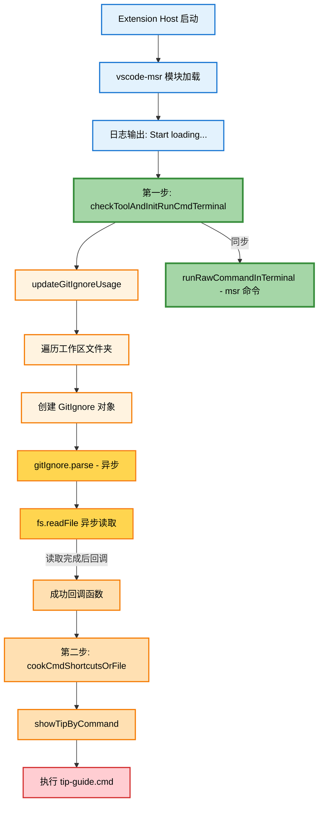

# vscode-msr 插件启动滞后分析报告

## 问题描述

用户反映插件两步启动间隔过长：
- **第一步**（msr 命令执行）较早完成
- **第二步**（tip-guide.cmd）启动太晚，与第一步间隔过长

## 日志分析

从 `extension-host.log` 日志文件分析关键时间点：

| 时间 | 事件 |
|------|------|
| 08:41:25.154 | Extension Host 启动 |
| 08:41:38.688 | vscode-msr 激活（约 13.5 秒后） |
| 08:41:40.797-08:41:40.802 | msr 配置访问 |

插件使用 `onStartupFinished` 激活事件，需等待其他约 20+ 个插件激活完成后才开始激活。

## 启动流程分析

### 流程图



### 关键代码位置

| 功能 | 文件位置 | 说明 |
|------|----------|------|
| 模块加载执行 | [`extension.ts:22-26`](../src/extension.ts:22) | 在 `activate()` 外部立即执行 |
| 第一步执行 | [`ToolChecker.ts:251-272`](../src/ToolChecker.ts:251) | `checkToolAndInitRunCmdTerminal()` |
| 异步读取触发 | [`gitUtils.ts:148`](../src/gitUtils.ts:148) | `fs.readFile()` 异步回调 |
| 第二步执行 | [`cookCommandAlias.ts:302`](../src/cookCommandAlias.ts:302) | `cookCmdShortcutsOrFile()` |
| 激活事件配置 | [`package.json:56-58`](../package.json:56) | `onStartupFinished` |

## 根本原因

### 1. 激活事件延迟

插件配置了 `onStartupFinished` 激活事件，意味着：
- 必须等待 VSCode 完全启动
- 必须等待其他所有高优先级插件激活完成
- 从 Extension Host 启动到插件激活约 **13.5 秒**

### 2. 模块加载时的同步与异步执行差异

插件在模块加载阶段（`activate()` 函数外部）立即执行初始化代码：

| 步骤 | 执行方式 | 延迟来源 |
|------|----------|----------|
| 第一步 msr 命令 | **同步执行** | 无 |
| 第二步 tip-guide.cmd | **异步回调** | 文件读取 + 回调链 |

### 3. 异步回调链

第二步的执行需要经过以下异步链路：

```
updateGitIgnoreUsage()
  ↓
GitIgnore.parse() 
  ↓
fs.readFile() [异步读取 .gitignore]
  ↓ (回调)
actionWhenSuccessfullyParsedGitIgnore()
  ↓
cookCmdShortcutsOrFile()
  ↓
showTipByCommand()
  ↓
执行 tip-guide.cmd
```

### 4. 时间消耗分析

| 阶段 | 时间消耗 |
|------|----------|
| 等待插件激活 | ~13.5 秒 |
| 第一步同步执行 | 毫秒级 |
| 异步文件读取 | 数十毫秒 |
| gitignore 规则解析 | 数十毫秒 |
| cookCmdShortcutsOrFile 处理 | 数百毫秒 |
| **第一步与第二步总间隔** | **数百毫秒至数秒** |

## 优化建议

### 方案一：改用同步文件读取

将 [`gitUtils.ts:148`](../src/gitUtils.ts:148) 的异步 `fs.readFile()` 改为同步的 `fs.readFileSync()`。

**优点**：消除异步回调延迟
**缺点**：可能阻塞插件激活流程

### 方案二：合并终端命令

将第一步和第二步的终端命令合并为单个命令执行，减少终端交互次数。

**优点**：减少命令执行开销
**缺点**：需要重构代码结构

### 方案三：并行执行优化

将 gitignore 解析与终端命令执行并行化：
1. 第一步立即执行 msr 命令
2. 同时启动 gitignore 异步解析
3. 解析完成后仅更新配置，不再执行额外终端命令

**优点**：最大化并行度
**缺点**：实现复杂度较高

### 方案四：延迟非关键操作

将 gitignore 解析等非关键操作移到 `activate()` 函数内部，或使用 `setTimeout` 延迟执行。

**优点**：不影响核心功能启动速度
**缺点**：可能影响后续功能的及时性

### 方案五：更早的激活事件

如果需要更早启动，可考虑将 `onStartupFinished` 改为：
- `*`：任何时候都激活
- 特定语言/文件类型触发

**优点**：大幅减少激活等待时间
**缺点**：可能影响 VSCode 启动性能

## 推荐方案

建议采用 **方案一 + 方案三** 的组合：

1. 将异步文件读取改为同步，消除回调延迟
2. 重构代码使两步操作尽可能靠近
3. 考虑将非关键的 gitignore 解析移到后台执行

## 相关文件清单

- [`src/extension.ts`](../src/extension.ts) - 插件入口和初始化
- [`src/ToolChecker.ts`](../src/ToolChecker.ts) - 工具检查和终端初始化
- [`src/gitUtils.ts`](../src/gitUtils.ts) - GitIgnore 解析
- [`src/cookCommandAlias.ts`](../src/cookCommandAlias.ts) - 命令别名生成
- [`package.json`](../package.json) - 插件配置和激活事件

---

## 💡 插件是否可以不用等 VSCode 完全启动？

**答案：是的，完全可以不用等！**

### 1. 分析插件的依赖

查看 [`extension.ts`](../src/extension.ts:22) 中模块加载时执行的代码：

```typescript
// 第22-26行 - 模块加载时立即执行
outputDebugByTime('Start loading extension and initialize ...');
RunCommandChecker.checkToolAndInitRunCmdTerminal();  // 检查工具并初始化终端
updateGitIgnoreUsage();  // 解析 .gitignore 文件
```

这些初始化代码 **不依赖于 VSCode 完全启动后的特定功能**：
- ✅ 访问工作区文件系统 - 模块加载时就可以
- ✅ 创建/操作终端 - 模块加载时就可以
- ✅ 执行外部命令（msr） - 模块加载时就可以

### 2. 激活事件选择对比

| 激活事件 | 激活时机 | 优点 | 缺点 |
|---------|---------|------|------|
| `onStartupFinished` | VSCode 完全启动后 | 不影响启动速度 | 延迟约13.5秒 |
| `*` | 立即激活 | 最早激活 | 可能轻微影响启动速度 |
| `workspaceContains:**/*` | 工作区有文件时 | 按需激活 | 需要工作区条件 |
| `onLanguage:*` | 打开任何文件时 | 按需激活 | 需要打开文件 |

### 3. 推荐方案

#### 方案 A：使用 `*` 激活事件（推荐）

修改 [`package.json`](../package.json:56) 第56-58行：

```json
"activationEvents": [
    "*"
]
```

**优点**：
- 插件随 VSCode 启动立即激活
- 初始化代码很快执行完成
- 用户打开终端时命令别名已准备好

**潜在影响**：
- 如果初始化代码执行时间 < 100ms，对 VSCode 启动速度影响极小
- 当前初始化主要是检查 msr 工具存在性，通常很快

#### 方案 B：使用 `workspaceContains` 激活事件

```json
"activationEvents": [
    "workspaceContains:**/*.{ts,js,py,java,cs,cpp,c,go,rs}"
]
```

**优点**：
- 打开包含代码文件的工作区时自动激活
- 比 `onStartupFinished` 更早

#### 方案 C：混合策略（保守方案）

保持 `onStartupFinished` 但优化初始化代码：

1. 将模块加载时的代码移到 `activate()` 函数中
2. 在 `activate()` 中使用 `setImmediate()` 让初始化代码异步执行
3. 将两步终端命令合并为一个

### 4. 激活流程对比图


### 5. 结论

**本插件完全可以不用等 VSCode 完全启动**，原因：

1. **初始化代码无特殊依赖** - 不需要等待 VSCode 的特定功能就绪
2. **初始化执行很快** - 主要是检查工具存在性和解析配置文件
3. **用户体验更好** - 更早完成初始化意味着用户打开终端时别名已准备好

建议将激活事件从 `onStartupFinished` 改为 `*`，这样可以：
- 节省约13.5秒的等待时间
- 让命令别名更早可用
- 对 VSCode 启动速度影响极小